# Fedora DMS & Niri Backup and Restore System

## Goal Description
Build a robust, modular, and elegant backup and restore system in `~/repos/fedora-dms-dotfiles` tailored for Fedora Linux (DNF5/DNF), Dank Material Shell (DMS), Niri Wayland compositor, Flatpaks, systemd user services, and desktop dotfiles.

### Key Requirements Incorporated
1. **DankMaterialShell First**: On restore, the core desktop environment (DMS, Niri, Quickshell, Matugen, dgop, and associated COPRs) is prioritized and installed first before general packages.
2. **`gum` for Progress & UI**: Uses Charm's [`gum`](https://github.com/charmbracelet/gum) for progress spinners (`gum spin`), styled banners (`gum style`), selection menus, and confirmations, with automatic bootstrapping of `gum` if missing.
3. **Dry-Run Mode (`--dry-run` / `-n`)**: Fully simulates and displays all actions, commands, and target file paths without modifying system state or installing packages.

---

## User Review Required

> [!IMPORTANT]
> **Priority DMS Phase**:
> During restore, Phase 1 prioritizes DankMaterialShell and Niri using the official automatic DankLinux installer (`curl -fsSL https://install.danklinux.com | sh`), configuring Niri compositor, Alacritty terminal, and all DMS features. It includes seamless automatic fallback to manual COPRs (`avengemedia/dms`, `avengemedia/danklinux`, `yalter/niri`) and DNF packages (`dms`, `dms-cli`, `dms-greeter`, `quickshell`, `matugen`, `dgop`, `niri`, `xwayland-satellite`) if offline. It then restores `~/.config/DankMaterialShell` & `~/.config/niri` with safety backups, and enables `dms.service`.

> [!NOTE]
> **Bootstrapping `gum`**:
> If running `restore.sh` on a fresh Fedora installation where `gum` is not yet installed, the script will automatically install `gum` via `sudo dnf install -y gum` before proceeding with the rich UI. If the terminal is non-interactive or `gum` cannot be installed, a clean ANSI fallback logger is used.

> [!NOTE]
> **Safety First**:
> Every restore operation creates a timestamped safety backup in `~/.dotfiles_backup/<timestamp>/` before touching any configuration files.

---

## Proposed Architecture & Workflow

```mermaid
flowchart TD
    subgraph RestoreFlow ["restore.sh Execution Flow"]
        BOOT["0. Bootstrap: Check/install 'gum' & parse args (--dry-run, --all, etc.)"]
        DMS_PHASE["1. DMS & Niri Priority Phase:\n- Official DankLinux installer (curl ... | sh)\n- Fallback: avengemedia & yalter COPRs + RPMs\n- Restore ~/.config/DankMaterialShell & ~/.config/niri\n- Enable systemctl --user dms.service"]
        REPO_PHASE["2. Enable Secondary Repos:\n- RPM Fusion (Free/Non-free)\n- Third-party repos (VSCodium, etc.)\n- Other COPRs (dejan/lazygit, imput/helium)"]
        PKG_PHASE["3. Install User DNF Packages:\n- Batch install dnf-packages.txt with gum spin"]
        FP_PHASE["4. Flatpaks:\n- Add remotes (Flathub, Fedora)\n- Install Flatpak apps"]
        DOT_PHASE["5. Remaining Dotfiles & Fonts:\n- Backup existing to ~/.dotfiles_backup/...\n- Sync Alacritty, Fastfetch, Neovim, GTK, Zsh configs\n- Bootstrap Oh My Zsh & plugins\n- Install fonts in ~/.local/share/fonts"]
        DCONF_PHASE["6. Desktop Settings:\n- Load dconf settings (dark mode, fonts, themes)"]
        SVC_PHASE["7. Secondary Services:\n- Verify and enable systemd user services"]
        DONE["8. Completion Summary (gum style banner)"]
    end

    BOOT --> DMS_PHASE --> REPO_PHASE --> PKG_PHASE --> FP_PHASE --> DOT_PHASE --> DCONF_PHASE --> SVC_PHASE --> DONE
```



---

## Proposed File Structure

```
/home/torvik/repos/fedora-dms-dotfiles/
├── .gitignore                      # Ignore safety backups, editor swaps, sensitive keys
├── README.md                       # Complete usage instructions, dry-run flags, options
├── config.env                      # Tracked dotfiles, exclusion patterns, repo lists
├── backup.sh                       # Backup entrypoint (supports --dry-run, --all, modular flags)
├── restore.sh                      # Restore entrypoint (DMS-first, gum progress, --dry-run)
├── install_dms.sh                  # Standalone installer for DMS Dank Linux & Niri
├── lib/
│   ├── ui.sh                       # gum wrapper (spinners, styles, headers, fallback text)
│   ├── dms_phase.sh                # DMS & Niri priority setup (COPRs, core RPMs, configs, service)
│   ├── repos.sh                    # Secondary COPRs and RPM repos export & installation
│   ├── packages.sh                 # DNF / DNF5 package export & batch/resilient install
│   ├── flatpaks.sh                 # Flatpak remotes & applications export & install
│   ├── dotfiles.sh                 # Dotfile backup, restore, timestamped backup creation
│   ├── dconf.sh                    # dconf desktop settings dump & import
│   └── services.sh                 # systemd --user service recording & enablement
├── data/
│   ├── repos/
│   │   ├── dms-copr.list           # Priority COPRs (avengemedia/dms, avengemedia/danklinux, yalter/niri)
│   │   ├── copr.list               # Secondary COPRs (dejan/lazygit, imput/helium)
│   │   └── rpm-repos.list          # RPM Fusion, NodeSource, VSCodium
│   ├── packages/
│   │   ├── dms-packages.txt        # Priority packages (dms, niri, quickshell, matugen, dgop, etc.)
│   │   └── dnf-packages.txt        # Remaining user-installed RPM packages
│   ├── flatpak/
│   │   ├── remotes.txt             # Flatpak remotes (flathub, fedora)
│   │   └── apps.txt                # Flatpak app IDs
│   ├── dconf/
│   │   └── settings.dconf          # dconf dump for GTK theme, dark mode, fonts
│   └── services/
│       └── user-services.txt       # Enabled user systemd units
└── dotfiles/
    ├── config/                     # Mapped to ~/.config/
    │   ├── DankMaterialShell/      # DMS settings, themes, plugins
    │   ├── niri/                   # Niri config, dms binds, rules, colors
    │   ├── alacritty/
    │   ├── cava/
    │   ├── doublecmd/
    │   ├── fastfetch/
    │   ├── fontconfig/
    │   ├── gtk-3.0/
    │   ├── gtk-4.0/
    │   ├── lazygit/
    │   ├── nvim/
    │   ├── qt5ct/
    │   ├── qt6ct/
    │   ├── starship.toml
    │   └── xsettingsd/
    ├── home/                       # Mapped to ~/
    │   ├── .zshrc
    │   ├── .zprofile
    │   ├── .zsh_aliases
    │   ├── .gitconfig
    │   ├── .xprofile
    │   └── .gtkrc-2.0
    └── local_share/                # Mapped to ~/.local/share/
        └── fonts/                  # MesloLGS Nerd Font, JetBrainsMono
```

---

## Detailed Component Specifications

### 1. `lib/ui.sh` (`gum` integration & fallback)
- Helper functions:
  - `ui_header "Title"`: Uses `gum style --border double --border-foreground 212 ...`
  - `ui_step "Step Description"`: Formats clear milestone headings.
  - `ui_spin "Action message" command_to_run`: Executes `gum spin --spinner dot --title "Action message" -- bash -c "..."`
  - `ui_confirm "Prompt"`: Calls `gum confirm "Prompt"` (bypassed if `--yes` or `--non-interactive` or `--dry-run`).
  - `ui_info`, `ui_success`, `ui_warn`, `ui_error`: Formatted badge logging.
  - Automatic fallback if `gum` is missing or when piped to a non-TTY.

### 2. `lib/dms_phase.sh` (Priority DMS Installation)
- Executes first during `restore.sh`:
  1. Automatic mode (default): Executes official DankLinux installer (`curl -fsSL https://install.danklinux.com | sh`) configured for Niri compositor (`-c niri`), Alacritty terminal (`-t alacritty`), and all features (`--all-features`).
  2. Fallback / Manual mode: Enables priority COPRs (`avengemedia/dms`, `avengemedia/danklinux`, `yalter/niri`) and installs core packages (`dms`, `dms-cli`, `dms-greeter`, `quickshell`, `matugen`, `dgop`, `niri`, `xwayland-satellite`) via resilient DNF.
  3. Deploys `~/.config/DankMaterialShell` and `~/.config/niri` configs with timestamped safety backups.
  4. Enables user service: `systemctl --user daemon-reload && systemctl --user enable dms.service`.
  5. In `--dry-run`, simulates installer commands and configs deployment without modifying system state.

### 3. Dry-Run Mode (`--dry-run` / `-n`)
- Implemented across both `backup.sh` and `restore.sh`.
- When active:
  - Prints `[DRY-RUN]` styled banners for every stage.
  - Simulates package manager queries, file copies (with `rsync -avun` or dry-run printouts), repo additions, and service commands.
  - No files are created outside the repository; no `sudo` commands are executed; no system state is altered.

### 4. `backup.sh`
- Interactive or flag-driven:
  - `./backup.sh`: Runs full backup.
  - `./backup.sh --dry-run`: Previews the backup without writing or copying anything.
  - `./backup.sh --dms`: Backs up DMS & Niri configs and package lists.
  - `./backup.sh --packages`: Exports DNF/COPR/RPM lists.
  - `./backup.sh --flatpaks`: Exports Flatpak remotes and apps.
  - `./backup.sh --dotfiles`: Copies tracked dotfiles with exclusions for cache/tokens.
  - `./backup.sh --dconf`: Dumps dconf settings.

### 5. `restore.sh`
- Interactive or flag-driven:
  - `./restore.sh --dry-run`: Simulates the entire restoration step-by-step.
  - `./restore.sh --all`: Full restoration (DMS first, then secondary repos, packages, flatpaks, dotfiles, dconf, services).
  - `./restore.sh --dms-only`: Restores only DankMaterialShell and Niri.
  - Flags for individual stages (`--packages`, `--flatpaks`, `--dotfiles`, `--dconf`, `--services`).

---

## Verification Plan

### Automated Verification
1. **Bootstrap & Syntax Checks**:
   - Run `bash -n` on all scripts (`backup.sh`, `restore.sh`, `lib/*.sh`).
   - Run `./backup.sh --help` and `./restore.sh --help` to check CLI argument parsing.
2. **Dry-Run Validation**:
   - Run `./backup.sh --dry-run` and verify `gum` spinner/banner styling and expected file lists.
   - Run `./restore.sh --dry-run` and verify Phase 1 DMS priority ordering, simulated package installs, and safety backup messages.
3. **Execution & Data Validation**:
   - Run `./backup.sh` to generate the repository data and dotfiles tree.
   - Inspect generated files:
     - `data/repos/dms-copr.list` and `data/repos/copr.list`
     - `data/packages/dms-packages.txt` and `data/packages/dnf-packages.txt`
     - `data/flatpak/remotes.txt` and `data/flatpak/apps.txt`
     - `data/dconf/settings.dconf`
     - `dotfiles/config/DankMaterialShell/` and `dotfiles/config/niri/`
   - Run `./restore.sh --dry-run` against the newly populated data to verify clean execution.
   - Verify `git status` in `fedora-dms-dotfiles` has clean staging without unwanted credentials or cache bloat.

### Manual Verification
- Review generated file lists to ensure no sensitive tokens or private keys are tracked.
- Test `restore.sh --dry-run` to confirm the visual `gum` experience and priority ordering.
