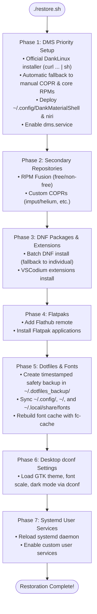

# Fedora DMS & Niri Dotfiles

<div align="center">

[](https://github.com/Torveek/fedora-dms-dotfiles)
[](https://getfedora.org/)
[](https://github.com/YaLTeR/niri)
[](https://github.com/AvengeMedia/DankMaterialShell)
[](https://github.com/charmbracelet/gum)

**A modular, elegant, and fault-tolerant backup & restore system for Fedora Linux, Dank Material Shell (DMS), Niri Wayland Compositor, Flatpaks, systemd user services, and desktop dotfiles.**

[Key Features](#key-features) •
[Repository Structure](#repository-structure) •
[Quick Start](#quick-start) •
[Backup & Sync](#backup-workflow) •
[Architecture](#restoration-architecture) •
[Tracked Components](#tracked-components) •
[Safety & Exclusions](#safety-protection)

</div>

---

## <a id="key-features"></a>🌟 Key Features

- **🚀 Dank Material Shell Priority Phase**: On restoration, the core desktop environment (DMS, Niri compositor, Quickshell, Matugen dynamic theming, dgop, and associated COPRs) is prioritized and installed first using the official automatic DankLinux installer (`curl -fsSL https://install.danklinux.com | sh`), with automatic fallback to manual COPR/RPM package installation if offline or needed.
- **✨ Modern Interactive CLI with `gum`**: Styled banners, progress spinners, interactive multi-select menus, and confirmations powered by [Charm's `gum`](https://github.com/charmbracelet/gum), with automatic DNF bootstrapping on fresh installs and graceful ANSI fallback.
- **🛡️ Zero-Data-Loss Safety Backups**: Restoring configurations never overwrites files blindly; timestamped safety backups are automatically generated in `~/.dotfiles_backup/<timestamp>/`.
- **🧪 Full Dry-Run Simulation (`--dry-run` / `-n`)**: Fully simulate and preview all operations, commands, package queries, and target file paths across both backup and restore without altering your system state.
- **⚡ Resilient Batch Package Management**: Handles DNF packages in high-speed batches, with graceful fallback to individual package installs to prevent failure from upstream package renames or removals.
- **🔒 Sensitive Data & Cache Filtering**: Strictly tracks essential configuration files while filtering out browser session tokens, VPN keys, Electron workspace storage, and temporary build caches.
- **🔤 Automated Typography & Theme Sync**: Automatically restores MesloLGS and JetBrainsMono Nerd Fonts, updates font caches, and imports dconf settings for GTK, Qt, and dark mode.

---

## <a id="repository-structure"></a>📂 Repository Structure

```
fedora-dms-dotfiles/
├── backup.sh                       # Backup entrypoint (interactive or flag-driven)
├── restore.sh                      # Restore entrypoint (DMS-first, gum progress)
├── install_dms.sh                  # Standalone installer for DMS Dank Linux & Niri
├── config.env                      # Tracked dotfiles, exclusion patterns, repo lists
├── lib/
│   ├── ui.sh                       # gum UI wrappers, spinners, badges & ANSI fallback
│   ├── dms_phase.sh                # Phase 1: DMS & Niri priority setup (COPRs, core RPMs, configs, service)
│   ├── repos.sh                    # Phase 2: Secondary COPRs and RPM Fusion / third-party repos
│   ├── packages.sh                 # Phase 3: DNF package export & resilient batch install + VSCodium extensions
│   ├── flatpaks.sh                 # Phase 4: Flatpak remotes & applications export & install
│   ├── dotfiles.sh                 # Phase 5: Dotfile backup, restore, safety backups, font cache refresh
│   ├── dconf.sh                    # Phase 6: dconf desktop settings dump & import
│   └── services.sh                 # Phase 7: systemd --user service recording & enablement
├── data/
│   ├── repos/                      # DMS COPRs, secondary COPRs, RPM repo tags
│   │   ├── dms-copr.list           # Priority DMS COPRs (avengemedia/dms, yalter/niri, etc.)
│   │   ├── copr.list               # Secondary COPRs (imput/helium, etc.)
│   │   └── rpm-repos.list          # Third-party repo definitions (RPM Fusion, etc.)
│   ├── packages/
│   │   ├── dms-packages.txt        # Core DMS RPM packages
│   │   └── dnf-packages.txt        # User-installed DNF RPM packages
│   ├── flatpak/
│   │   ├── remotes.txt             # Flatpak remotes (flathub, etc.)
│   │   └── apps.txt                # Flatpak application IDs
│   ├── dconf/
│   │   └── settings.dconf          # GNOME/GTK dark mode, fonts, themes dconf dump
│   ├── services/
│   │   └── user-services.txt       # Enabled custom systemd user services
│   └── extensions/
│       └── vscodium.txt            # VSCodium extension IDs
└── dotfiles/
    ├── config/                     # Mapped to ~/.config/
    │   ├── DankMaterialShell/      # DMS settings, plugins, themes, changelogs
    │   ├── niri/                   # Niri config.kdl, DMS theme sync
    │   ├── alacritty/              # Alacritty configuration & theme
    │   ├── cava/                   # Cava audio visualizer configuration
    │   ├── doublecmd/              # Double Commander config, colors, shortcuts
    │   ├── fastfetch/              # Fastfetch system info layout
    │   ├── fontconfig/             # Custom font rendering configurations
    │   ├── gtk-3.0/ & gtk-4.0/     # GTK themes, CSS styling, dank-colors
    │   ├── lazygit/                # Lazygit configuration
    │   ├── nvim/                   # Neovim (LazyVim setup, plugins, keymaps)
    │   ├── qt5ct/ & qt6ct/         # Qt styling and Matugen color schemes
    │   ├── xsettingsd/             # XSettings daemon configuration
    │   ├── starship.toml           # Starship cross-shell prompt configuration
    │   └── mimeapps.list           # Default file association mappings
    ├── home/                       # Mapped to ~/
    │   ├── .bashrc                 # Bash aliases, functions, environment variables
    │   ├── .bash_profile          # Login shell environment
    │   ├── .gitconfig              # Git configuration
    │   ├── .xprofile               # X11 / Wayland session profile
    │   └── .gtkrc-2.0              # GTK 2 legacy application styling
    └── local_share/                # Mapped to ~/.local/share/
        └── fonts/                  # JetBrainsMono & MesloLGS Nerd Fonts
```

---

## <a id="quick-start"></a>🚀 Quick Start (Fresh Installation)

### 1. Clone the Repository

On your fresh Fedora installation, clone this repository:

**Via HTTPS:**
```bash
git clone https://github.com/Torveek/fedora-dms-dotfiles.git ~/repos/fedora-dms-dotfiles
cd ~/repos/fedora-dms-dotfiles
```

**Via SSH:**
```bash
git clone git@github.com:Torveek/fedora-dms-dotfiles.git ~/repos/fedora-dms-dotfiles
cd ~/repos/fedora-dms-dotfiles
```

---

### 2. Standalone DMS Installation (Optional)

If you only want to install Dank Material Shell, Niri, and configure `dms-greeter` without restoring the rest of the dotfiles:

```bash
# Preview installation actions
./install_dms.sh --dry-run

# Run interactive installation
./install_dms.sh

# Run unattended installation
./install_dms.sh -y
```

This runs the official DankLinux automatic installer (`curl -fsSL https://install.danklinux.com | sh`), configures `dms-greeter` for `greetd`, and enables systemd user services.

---

### 3. Run the Restore Script

#### Preview First (Dry-Run):
Preview all actions, package installations, and file paths without making any system changes:
```bash
./restore.sh --dry-run
```

#### Full Restoration (Recommended):
Restores all components with interactive confirmations:
```bash
./restore.sh --all
```

To run unattended without prompts:
```bash
./restore.sh --all -y
```

#### Selective Restoration Options:
If you only need specific components restored:
```bash
./restore.sh --dms-only       # Quick setup: DMS, Niri, Quickshell & dms.service
./restore.sh --repos          # Enable secondary COPRs & RPM repositories
./restore.sh --packages       # Install user DNF packages & VSCodium extensions
./restore.sh --flatpaks       # Configure Flatpak remotes & install applications
./restore.sh --dotfiles       # Restore dotfiles and fonts (with safety backup)
./restore.sh --dconf          # Load desktop dconf settings (themes, fonts, dark mode)
./restore.sh --services       # Enable and reload systemd user services
```

#### Dank Material Shell Installation Methods:
Phase 1 defaults to the official automatic DankLinux installer (`curl -fsSL https://install.danklinux.com | sh`) preconfigured for Niri compositor and Alacritty terminal (`--compositor niri --term alacritty --all-features`). You can customize or switch installation methods at any time:
```bash
./restore.sh --all                        # Default: uses official DankLinux automatic installer
./restore.sh --all --dms-auto             # Explicitly specify official automatic installer
./restore.sh --all --dms-manual           # Use direct COPR enablement & DNF package lists
./restore.sh --dms-only --force-dms       # Force re-running the official installer even if packages exist
```
> [!TIP]
> You can configure the installer URL, target compositor, terminal, and extra flags directly in `config.env` (`DMS_INSTALL_METHOD`, `DMS_INSTALLER_COMPOSITOR`, `DMS_INSTALLER_TERM`, `DMS_INSTALLER_ALL_FEATURES`). If the official online installer is unreachable, `restore.sh` automatically offers to fall back to the offline repository lists.

#### Resilient Package Installation & Unavailable Packages:
By default, `restore.sh` passes `--skip-unavailable` to DNF (supported in DNF5 / Fedora 41+) so that packages unavailable in standard repositories (such as `firefoxpwa` or custom packages) do not halt the entire restoration. At the end of restoration, any uninstalled packages are clearly listed in a summary with recommendations for manual installation:
```bash
./restore.sh --all                     # Default: skips unavailable packages and lists them at the end
./restore.sh --all --no-skip-unavailable  # Fail immediately if any package is missing from repositories
```

---

### 4. Post-Restore Steps

1. **Log into Niri**: Log out of your current session or reboot, and choose **Niri** from your display manager (SDDM/GDM).
2. **Verify DMS Service**: Ensure Dank Material Shell user service is active:
   ```bash
   systemctl --user status dms.service
   ```
3. **Verify Fonts**: Font cache is automatically rebuilt during restore (`fc-cache -f ~/.local/share/fonts`). Test in your terminal:
   ```bash
   fc-list : family | grep -E "Meslo|JetBrains"
   ```

---

## <a id="backup-workflow"></a>🔄 Backup & Sync Workflow

Keep your dotfiles and package lists in sync as your system evolves.

### 1. Run the Backup Script

```bash
# Preview what would be backed up without changing repository files:
./backup.sh --dry-run

# Run interactive full backup:
./backup.sh

# Run full backup non-interactively:
./backup.sh --all -y
```

#### Selective Backup Options:
```bash
./backup.sh --dms             # Only DankMaterialShell and Niri configs/packages
./backup.sh --repos           # Only COPR and RPM repository lists
./backup.sh --packages        # Only DNF user-installed packages & VSCodium extensions
./backup.sh --flatpaks        # Only Flatpak apps and remotes
./backup.sh --dotfiles        # Only tracked dotfiles and fonts
./backup.sh --dconf           # Only desktop dconf settings
./backup.sh --services        # Only systemd user services
```

### 2. Commit and Push Changes

After running `./backup.sh`, inspect the changes and push them back to GitHub:

```bash
# Check modified configurations and package lists
git status
git diff

# Stage and commit your changes
git add -A
git commit -m "chore: sync dotfiles and updated package lists"

# Push to your remote repository
git push origin main
```

---

## <a id="restoration-architecture"></a>🏗️ Restoration Architecture

Restoration executes in a structured, fault-tolerant sequence:



---

## <a id="tracked-components"></a>📦 Tracked Components

| Category | Component / Tool | Configuration Path |
| :--- | :--- | :--- |
| **Compositor & Shell** | Niri Wayland Compositor | `~/.config/niri/` |
| | Dank Material Shell & Greeter | `~/.config/DankMaterialShell/` |
| | Quickshell, Matugen, dgop | `dms.service` & `~/.config/niri/dms/` |
| **Terminals & Prompt** | Alacritty | `~/.config/alacritty/` |
| | Starship Prompt | `~/.config/starship.toml` |
| | Bash Shell | `~/.bashrc`, `~/.bash_profile` |
| | Cava Audio Visualizer | `~/.config/cava/` |
| | Fastfetch | `~/.config/fastfetch/` |
| **Editors & Dev** | Neovim (LazyVim setup) | `~/.config/nvim/` |
| | VSCodium Extensions | `data/extensions/vscodium.txt` |
| | Lazygit & Git | `~/.config/lazygit/`, `~/.gitconfig` |
| **File Management** | Double Commander | `~/.config/doublecmd/` |
| **Theming & Desktop** | GTK 3.0 & GTK 4.0 | `~/.config/gtk-3.0/`, `~/.config/gtk-4.0/` |
| | Qt5 & Qt6 Settings | `~/.config/qt5ct/`, `~/.config/qt6ct/` |
| | Fontconfig & Mimeapps | `~/.config/fontconfig/`, `~/.config/mimeapps.list` |
| | dconf Desktop Settings | `data/dconf/settings.dconf` |
| **Typography** | MesloLGS Nerd Font Mono | `~/.local/share/fonts/MesloLGS Nerd Font Mono/` |
| | JetBrainsMono Nerd Font | `~/.local/share/fonts/JetBrainsMono/` |
| **Services & Packages** | DNF5 / DNF RPM Packages | `data/packages/` |
| | Flatpak Apps & Remotes | `data/flatpak/` |
| | systemd User Services | `data/services/` |

---

## <a id="safety-protection"></a>🛡️ Safety & Data Protection

### Automatic Pre-Restore Backup
Whenever `restore.sh` modifies an existing configuration in `~/.config` or `~/`, it creates a timestamped safety copy first:
```
~/.dotfiles_backup/20261004_221500/
├── .config/
│   ├── DankMaterialShell/
│   ├── alacritty/
│   └── niri/
├── .bashrc
└── .gitconfig
```
If you ever want to revert a restore, your original files remain untouched in `~/.dotfiles_backup/`.

### Exclusions & Security Guardrails
The backup system strictly excludes credentials, private tokens, and temporary bloat:
- **Browser sessions & tokens**: `~/.mozilla`, `net.imput.helium`, `chromium`, `google-chrome`
- **VPN / Proxy configurations**: `AmneziaVPN.ORG`, `Happ`, `Happ.conf`, `clash-verge-rev`
- **VS Code workspace cache**: `workspaceStorage`, `History`, `*.log`, `*.cache`
- **Private keys & credentials**: `*.key`, `*.pem`, `id_*`, `*.token`, `*.kdbx`
- **Temporary archives & sockets**: `*.tar.gz`, `*.sock`, `*.swp`

---

## <a id="dependencies"></a>🧩 Dependencies & System Requirements

- **Operating System**: Fedora Linux 40+ (tested on Fedora 44 with `dnf5`)
- **CLI UI**: Charm's [`gum`](https://github.com/charmbracelet/gum) *(automatically bootstrapped via DNF if missing)*
- **Core Utilities**: `bash 5+`, `dnf5` / `dnf`, `rpm`, `rsync`, `flatpak`, `dconf`, `systemd`

---

## <a id="license-author"></a>📄 License & Author

Maintained by [Torveek](https://github.com/Torveek).  
Repository: [Torveek/fedora-dms-dotfiles](https://github.com/Torveek/fedora-dms-dotfiles)
