# Fedora DMS & Niri Backup and Restore System

## Goal Description
Build an automated, robust, modular backup and restore system in `~/repos/fedora-dms-dotfiles` tailored for Fedora (DNF5/DNF), Dank Material Shell (DMS), Niri Wayland compositor, Flatpaks, systemd user services, and desktop dotfiles.

The system will provide:
1. `backup.sh`: Dumps package lists (DNF user-installed, COPR repos, third-party repos), Flatpak remotes and installed apps, desktop dconf settings, systemd user services, VSCodium extensions, and syncs selected dotfiles into the git repository while excluding sensitive credentials and bulky browser caches.
2. `restore.sh`: Provisions a clean Fedora installation or syncs an existing system by enabling repositories (RPM Fusion, COPRs), installing packages, adding Flatpak remotes and apps, restoring dotfiles (with timestamped safety backups), importing dconf settings, and enabling user services (`dms.service`).
3. Modular execution: Allows running full backup/restore or selective steps (`--dotfiles`, `--packages`, `--flatpaks`, `--repos`, `--dconf`, `--services`, `--dry-run`).

---

## System Inspection Findings (Discovered Automatically)
Because execution access is available in your workspace, the following setup was detected directly:
- **Operating System**: Fedora Linux 44 (Workstation, x86_64, standard RPM + DNF5)
- **Desktop / Compositor**:
  - **Niri**: Configured in `~/.config/niri/` (includes `config.kdl`, `dms/` includes for keybinds, layout, rules, colors)
  - **Dank Material Shell (DMS)**: Configured in `~/.config/DankMaterialShell/` (settings, themes, plugin config)
  - **Systemd User Service**: `dms.service` enabled under `systemctl --user`
- **Active Repositories**:
  - COPRs: `avengemedia/danklinux`, `avengemedia/dms`, `dejan/lazygit`, `imput/helium`, `yalter/niri`
  - RPM Fusion: `rpmfusion-free`, `rpmfusion-nonfree` (and updates)
  - Third-party: NodeSource (`nodesource-nodejs.repo`), VSCodium (`vscodium.repo`)
- **Package Managers**:
  - DNF / DNF5: 218 user-installed RPM packages
  - Flatpak: Remotes `flathub` and `fedora`, installed apps: `com.termius.Termius`, `md.obsidian.Obsidian`, `net.epson.epsonscan2`
- **User Configs & Shell**:
  - Shell: Bash (`~/.bashrc`, starship, zoxide), terminal: Alacritty (`~/.config/alacritty`)
  - Utilities: Fastfetch, Lazygit, Neovim, Cava, Fontconfig, GTK 3/4, qt5ct/qt6ct, xsettingsd
  - VSCodium: Configs (`settings.json`, `keybindings.json`) and 8 installed extensions
  - Fonts: MesloLGS Nerd Font and JetBrainsMono in `~/.local/share/fonts`
  - Themes / GTK: Stored in `dconf` (`color-scheme='prefer-dark'`, fonts, accents)

---

## User Review Required

> [!IMPORTANT]
> **Dotfiles Scope & Sensitive Data Filtering**:
> - Browser caches/profiles (`~/.mozilla`, `~/.config/net.imput.helium`), electron app caches (`~/.config/VSCodium/workspaceStorage`), and VPN configs (`AmneziaVPN.ORG`, `Happ`, `io.github.clash-verge-rev.clash-verge-rev`) often contain session cookies, tokens, or private keys.
> - By default, the plan configures `backup.sh` with a strict whitelist / clean list of desktop configs (Niri, DMS, Alacritty, Fastfetch, GTK, Neovim, Lazygit, Starship, VSCodium user settings, fonts), leaving sensitive VPN/browser session credentials safe from accidental git commits.

> [!NOTE]
> **Restore Safety**:
> `restore.sh` will **never** overwrite existing files without creating a timestamped backup first in `~/.dotfiles_backup/<timestamp>/`.

---

## Proposed Architecture

```mermaid
flowchart TD
    subgraph Repository ["fedora-dms-dotfiles Repo"]
        CFG["config.env (Configuration & Paths)"]
        BK["backup.sh"]
        RS["restore.sh"]
        LIB["lib/ (packages, flatpaks, dotfiles, dconf, services, utils)"]
        DATA["data/ (copr.list, dnf-packages.txt, flatpaks, dconf, services)"]
        DOTS["dotfiles/ (config/, home/, local_share/)"]
    end

    subgraph LiveSystem ["Live Fedora System"]
        DNF["DNF / DNF5 & COPR Repos"]
        FP["Flatpak Remotes & Apps"]
        DMS["Dank Material Shell & Niri"]
        DCONF["dconf Desktop Settings"]
        SVCS["systemd --user services"]
        HOME["~/.config, ~/.local/share, ~/.*"]
    end

    BK -- "Dumps package lists, dconf, services" --> DATA
    BK -- "Copies tracked configs & fonts" --> DOTS
    RS -- "Enables COPRs & installs RPMs" --> DNF
    RS -- "Installs Flatpaks" --> FP
    RS -- "Deploys configs (with safety backup)" --> HOME
    RS -- "Loads themes & fonts" --> DCONF
    RS -- "Enables & starts user services" --> SVCS
```



---

## Proposed File Structure

```
/home/torvik/repos/fedora-dms-dotfiles/
├── .gitignore                      # Ignore backups, temporary files, editor swaps
├── README.md                       # Documentation, usage guide, manual steps
├── config.env                      # Tracked dotfile folders, excluded patterns, repo URLs
├── backup.sh                       # Interactive / flag-based backup entrypoint
├── restore.sh                      # Interactive / flag-based restore entrypoint
├── lib/
│   ├── utils.sh                    # Pretty logging (INFO, WARN, SUCCESS, ERROR), checks
│   ├── repos.sh                    # COPR & third-party repository export/import
│   ├── packages.sh                 # DNF / DNF5 package export & installation
│   ├── flatpaks.sh                 # Flatpak remotes & applications export/install
│   ├── dotfiles.sh                 # Dotfile backup, restore, backup timestamping, diffing
│   ├── dconf.sh                    # GNOME / GTK / Desktop dconf settings dump & load
│   └── services.sh                 # systemd --user service recording & enablement
├── data/
│   ├── repos/
│   │   ├── copr.list               # COPR repos (e.g. avengemedia/dms, yalter/niri)
│   │   └── rpm-repos.list          # Third-party repo definitions / URLs (RPM Fusion, etc.)
│   ├── packages/
│   │   └── dnf-packages.txt        # User-installed RPM package list
│   ├── flatpak/
│   │   ├── remotes.txt             # Flatpak remotes (flathub, fedora)
│   │   └── apps.txt                # Flatpak app IDs
│   ├── dconf/
│   │   └── settings.dconf          # dconf dump for GTK theme, dark mode, fonts
│   ├── services/
│   │   └── user-services.txt       # Enabled systemd user units (e.g. dms.service)
│   └── extensions/
│       └── vscodium.txt            # VSCodium extension IDs
└── dotfiles/
    ├── config/                     # Mapped to ~/.config/
    │   ├── DankMaterialShell/
    │   ├── niri/
    │   ├── alacritty/
    │   ├── cava/
    │   ├── doublecmd/
    │   ├── fastfetch/
    │   ├── fontconfig/
    │   ├── gtk-3.0/
    │   ├── gtk-4.0/
    │   ├── lazygit/
    │   ├── nvim/
    │   ├── qt5ct/
    │   ├── qt6ct/
    │   ├── starship.toml
    │   ├── xsettingsd/
    │   └── VSCodium/User/          # settings.json, keybindings.json (clean, no cache)
    ├── home/                       # Mapped to ~/
    │   ├── .bashrc
    │   ├── .bash_profile
    │   ├── .gitconfig
    │   ├── .xprofile
    │   └── .gtkrc-2.0
    └── local_share/                # Mapped to ~/.local/share/
        └── fonts/                  # Custom fonts (MesloLGS, JetBrainsMono)
```

---

## Detailed Component Plans

### 1. `config.env`
Defines arrays of:
- `CONFIG_DIRS`: `("DankMaterialShell" "niri" "alacritty" "cava" "fastfetch" "fontconfig" "gtk-3.0" "gtk-4.0" "lazygit" "nvim" "qt5ct" "qt6ct" "xsettingsd")`
- `CONFIG_FILES`: `("starship.toml" "kcminputrc" "kdeglobals" "mimeapps.list")`
- `HOME_FILES`: `(".bashrc" ".bash_profile" ".gitconfig" ".xprofile" ".gtkrc-2.0")`
- `EXTRA_DIRS`: `(".local/share/fonts")`
- Exclude rules for caches (`.cache`, `*Cache*`, `workspaceStorage`, `History`, `*.log`, `node_modules`, `*.sock`)

### 2. `backup.sh`
- Can be invoked as `./backup.sh` (backs up all) or with flags:
  - `./backup.sh --dotfiles`: Only syncs dotfiles to the repo
  - `./backup.sh --packages`: Only exports DNF packages, COPRs, and RPM repos
  - `./backup.sh --flatpaks`: Only exports Flatpak remotes and apps
  - `./backup.sh --dconf`: Only exports dconf desktop settings
  - `./backup.sh --services`: Only exports enabled systemd user services
  - `./backup.sh --dry-run`: Shows what would be backed up without copying
- Packages exported cleanly using `dnf5 repoquery --userinstalled` or `dnf repoquery --userinstalled`.
- COPRs exported by parsing `/etc/yum.repos.d/_copr:*.repo`.
- Flatpaks exported using `flatpak remotes` and `flatpak list --app --columns=application`.
- DMS & Niri configs copied cleanly; removes any large runtime temporary files.

### 3. `restore.sh`
- Supports interactive prompts or flags:
  - `./restore.sh --all` (full system setup)
  - `./restore.sh --repos`: Enables RPM Fusion and COPR repositories
  - `./restore.sh --packages`: Installs DNF packages from `data/packages/dnf-packages.txt`
  - `./restore.sh --flatpaks`: Adds Flatpak remotes and installs Flatpak apps
  - `./restore.sh --dotfiles`: Restores dotfiles with backup of existing files
  - `./restore.sh --dconf`: Loads desktop font/theme settings via `dconf load`
  - `./restore.sh --services`: Enables and starts user services (`systemctl --user enable --now dms.service`)
  - `--dry-run`: Previews actions without changing the system
- Fault-tolerant package installation:
  - First attempts batch install with `dnf install -y $(cat ...)`.
  - If a specific package fails (e.g. removed in Fedora 45), fallback to per-package install or logging missing packages without stopping the entire restoration process.

### 4. Git Repository Setup
- Initialize git repo in `/home/torvik/repos/fedora-dms-dotfiles`.
- Provide a clean `.gitignore` to prevent committing secrets (`id_rsa`, `*.pem`, `*.key`, `.env`, tokens, etc.).

---

## Verification Plan

### Automated Verification
1. Run `./backup.sh --dry-run` to verify paths and file detection.
2. Run `./backup.sh` to generate the complete data files and dotfile tree.
3. Validate data integrity:
   - Check `data/repos/copr.list` contains expected COPRs (`avengemedia/dms`, `yalter/niri`, etc.).
   - Check `data/packages/dnf-packages.txt` contains expected packages.
   - Check `data/flatpak/apps.txt` contains expected Flatpaks (`com.termius.Termius`, etc.).
   - Check `data/dconf/settings.dconf` is non-empty and valid INI format.
   - Check dotfiles directory contains Niri config, DMS settings/plugins, Alacritty, bashrc, etc.
4. Test `./restore.sh --dry-run` to ensure no syntax errors or invalid paths.
5. Test dotfile backup/restore mechanism in a sandboxed test folder.

### Manual Verification
- Review exported repository lists and packages to verify all necessary tools are captured.
- Inspect `git status` in `fedora-dms-dotfiles` to confirm no unwanted sensitive or bulky files are included.
